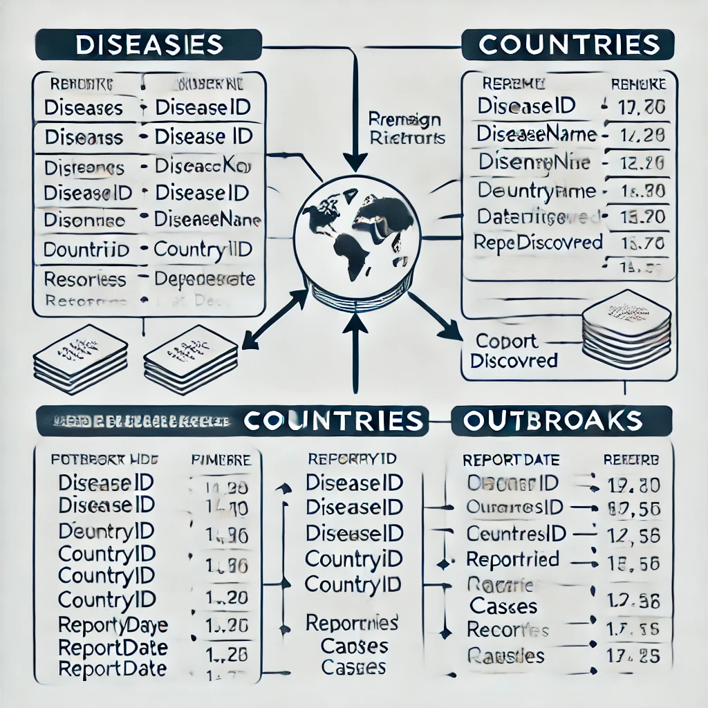

# Global Disease Outbreak Tracker

The **Global Disease Outbreak Tracker** is a database solution designed to track global disease outbreaks with advanced reporting features. It provides detailed insights into disease trends by region, country, and time period. This project leverages SQL to create a scalable, dynamic, and efficient system for outbreak management and analysis.

---

## **Key Features**
- **Dynamic SQL Reports**: Generate weekly or monthly trend reports.
- **Aggregate Analysis**: Analyze trends by region, country, or disease.
- **Fatality Rate Insights**: Calculate fatality rates for each disease.
- **Scalable Design**: Easily add new diseases, regions, or outbreaks.
- **Automated Data Trends**: Use stored procedures for flexible reporting intervals.

---

## **File Structure**
```plaintext
GlobalDiseaseOutbreakTracker/
│
├── SQL_Scripts/
│   ├── 1_Create_Tables.sql            # Script to create database tables
│   ├── 2_Insert_Sample_Data.sql       # Script to insert sample data
│   ├── 3_Stored_Procedures.sql        # Stored procedures for dynamic reports
│   ├── 4_Dynamic_Reports.sql          # Example calls to dynamic reports
│
├── README.md                          # Documentation for the project
└── Documentation/
    ├── Database_Schema_Diagram.png    # Diagram of database schema
    ├── Dynamic_Report_Examples.md     # Example queries for dynamic reporting
    ├── Usage_Guide.md                 # Step-by-step guide for using the project
```

# Getting Started

## Prerequisites
- MySQL installed on your system.
- Basic understanding of SQL.
- Setup Instructions
- Clone the repository:

 ```bash
git clone https://github.com/AdityaSrivastavDS/Global-Disease-Outbreak-Tracker
cd GlobalDiseaseOutbreakTracker
 ```

## Import the SQL scripts in the following order:

- 1_Create_Tables.sql to set up the database and tables.
- 2_Insert_Sample_Data.sql to populate the database with sample data.
- 3_Stored_Procedures.sql to create stored procedures.
- 4_Dynamic_Reports.sql to test dynamic reporting.
- Use MySQL Workbench or a terminal to execute the scripts.

## Usage
- Generate Weekly/Monthly Reports:
 ```bash
CALL GenerateTrendReport('weekly'); -- Weekly trends
CALL GenerateTrendReport('monthly'); -- Monthly trends
 ```

- Analyze Cases by Region:
 ```bash
SELECT Region, SUM(Cases) AS TotalCases, SUM(Recoveries) AS TotalRecoveries, SUM(Fatalities) AS TotalFatalities
FROM Outbreaks
JOIN Countries ON Outbreaks.CountryID = Countries.CountryID
GROUP BY Region;
 ```

- Calculate Fatality Rates:
 ```bash
SELECT DiseaseName, SUM(Fatalities) * 100.0 / SUM(Cases) AS FatalityRate
FROM Outbreaks
JOIN Diseases ON Outbreaks.DiseaseID = Diseases.DiseaseID
GROUP BY DiseaseName;
 ```

## Database Schema Preview


## Documentation
Detailed documentation is available in the Documentation/ folder:

- Database_Schema_Diagram.png: A visual representation of table relationships.
- Dynamic_Report_Examples.md: Examples of dynamic queries and reports.
- Usage_Guide.md: Step-by-step guide for setting up and using the project.

## Contributing
We welcome contributions! Feel free to submit pull requests or report issues.

## License
This project is licensed under the MIT License. See LICENSE for details.